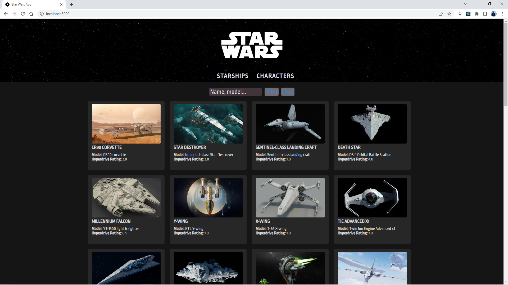
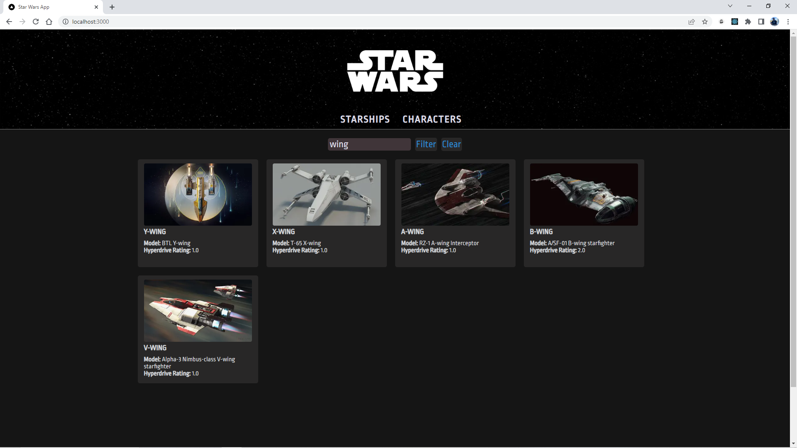
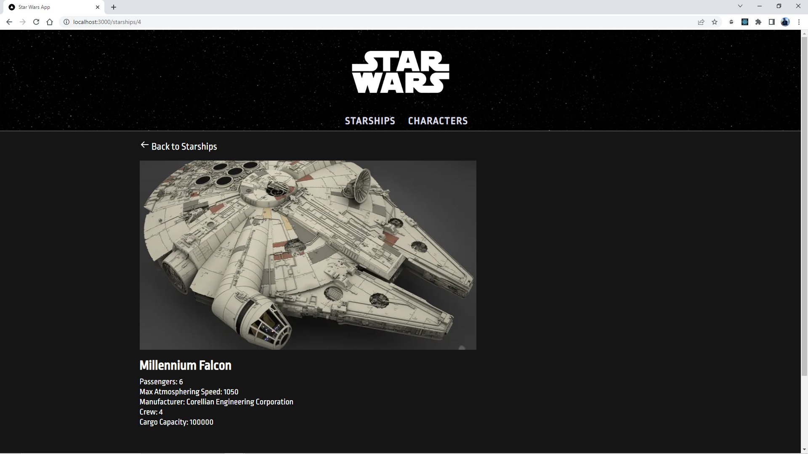
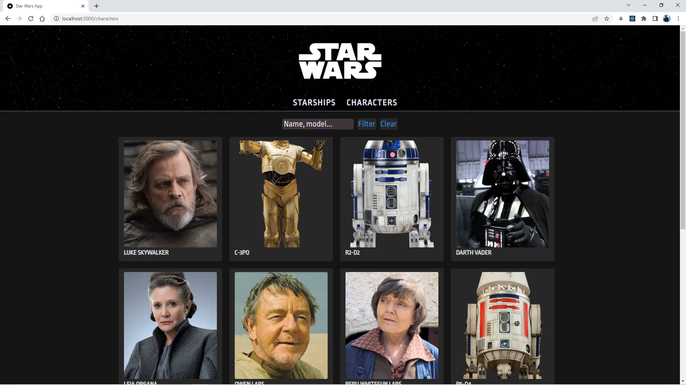
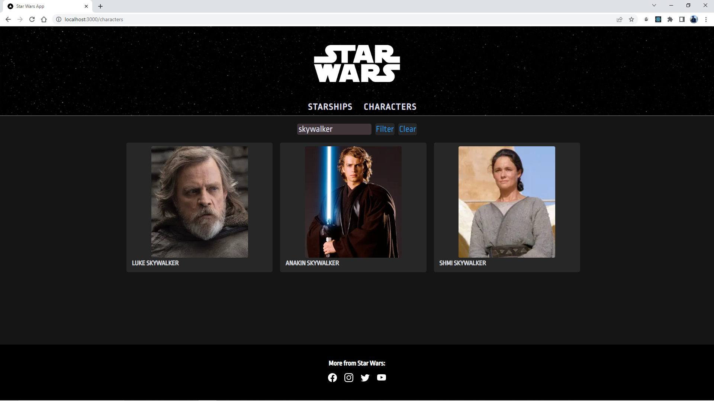
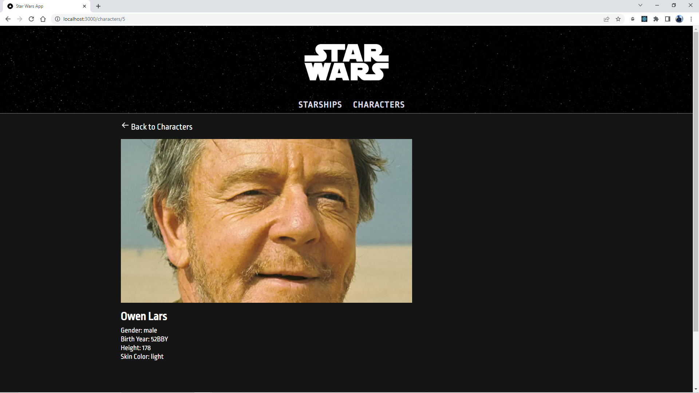

# Star Wars Clone

This project is developed by myself for the Patika.dev FMSS Bilişim Front-end Practicum Final Case assignment.

I aimed to develop a production-grade application therefore I developed this project using Next.js and Typescript.

Next/Image optimizes images with lazy loading.

All module css files are in `styles` folder.

I used SWAPI for Star Wars data. SWAPI does not provide any image because of that I used `data/Image.json` file that holds Image URL data.

I implemented SSG (Static-site generation) in Starship Detail pages using `getStaticProps()` and `getStaticPaths()` from Next.js

Layout is fully responsive and mobile compatible.

## Features

- Listing sharships and characters
- Search among starships and characters
- Read details of a specific starship or character
- Load more starships or characters with a load more button

## Used Libraries

- React
- Next.js
- Axios
- React Icons

This is a [Next.js](https://nextjs.org/) project bootstrapped with [`create-next-app`](https://github.com/vercel/next.js/tree/canary/packages/create-next-app).

## Screenshots

### Starships



### Starships: Filtered Results



### Starships: Detail Page



### Characters



### Characters: Filtered Results



### Characters: Detail Page



## Getting Started

Static-site generation doesn't work on development mode, we generate detail pages as static html files.

Install NPM packages

```
npm install
```

Build app for production

```
npm run build
```

Start app in production mode

```
npm run start
```
